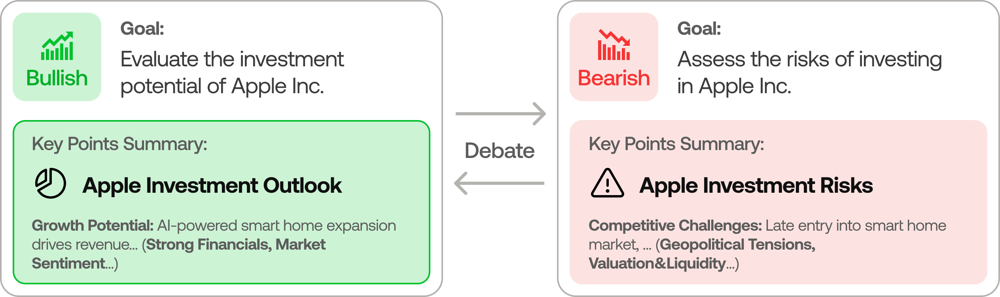
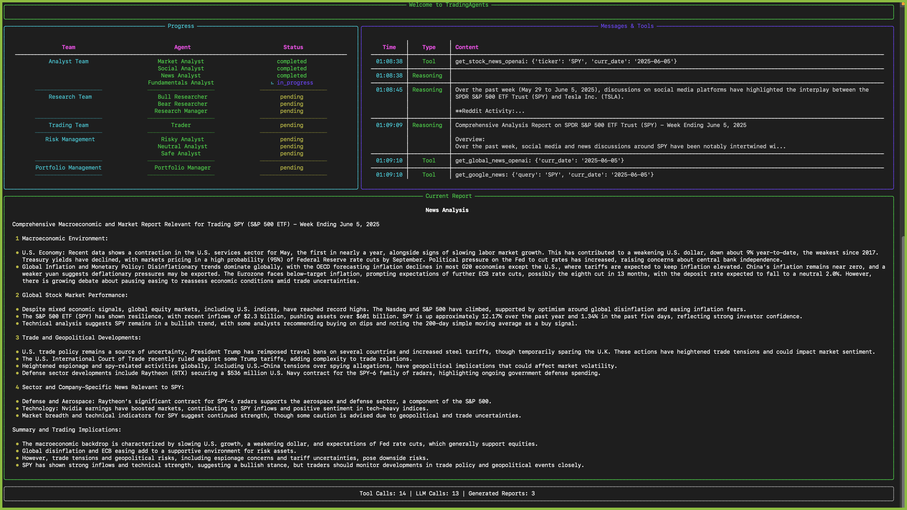
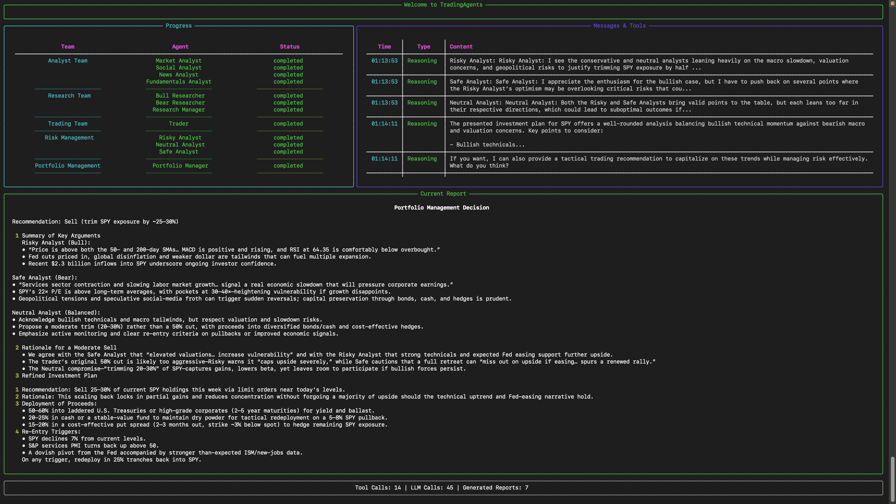

# TradingAgents 代码解读报告

- 代码根目录：`/mnt/data/TradingAgents-main`
- 文件总数：73, 其中 Python 文件：53

## 项目 README 摘要

```
<p align="center">
  
</p>

<div align="center" style="line-height: 1;">
  <a href="https://arxiv.org/abs/2412.20138" target="_blank"></a>
  <a href="https://discord.com/invite/hk9PGKShPK" target="_blank"></a>
  <a href="./assets/wechat.png" target="_blank"></a>
  <a href="https://x.com/TauricResearch" target="_blank"></a>
  <br>
  <a href="https://github.com/TauricResearch/" target="_blank"></a>
</div>

<div align="center">
  <!-- Keep these links. Translations will automatically update with the README. -->
  <a href="https://www.readme-i18n.com/TauricResearch/TradingAgents?lang=de">Deutsch</a> | 
  <a href="https://www.readme-i18n.com/TauricResearch/TradingAgents?lang=es">Español</a> | 
  <a href="https://www.readme-i18n.com/TauricResearch/TradingAgents?lang=fr">français</a> | 
  <a href="https://www.readme-i18n.com/TauricResearch/TradingAgents?lang=ja">日本語</a> | 
  <a href="https://www.readme-i18n.com/TauricResearch/TradingAgents?lang=ko">한국어</a> | 
  <a href="https://www.readme-i18n.com/TauricResearch/TradingAgents?lang=pt">Português</a> | 
  <a href="https://www.readme-i18n.com/TauricResearch/TradingAgents?lang=ru">Русский</a> | 
  <a href="https://www.readme-i18n.com/TauricResearch/TradingAgents?lang=zh">中文</a>
</div>

---

# TradingAgents: Multi-Agents LLM Financial Trading Framework 

> 🎉 **TradingAgents** officially released! We have received numerous inquiries about the work, and we would like to express our thanks for the enthusiasm in our community.
>
> So we decided to fully open-source the framework. Looking forward to building impactful projects with you!

<div align="center">
<a href="https://www.star-history.com/#TauricResearch/TradingAgents&Date">
 <picture>
   <source media="(prefers-color-scheme: dark)" srcset="https://api.star-history.com/svg?repos=TauricResearch/TradingAgents&type=Date&theme=dark" />
   <source media="(prefers-color-scheme: light)" srcset="https://api.star-history.com/svg?repos=TauricResearch/TradingAgents&type=Date" />
   
 </picture>
</a>
</div>

<div align="center">

🚀 [TradingAgents](#tradingagents-framework) | ⚡ [Installation & CLI](#installation-and-cli) | 🎬 [Demo](https://www.youtube.com/watch?v=90gr5lwjIho) | 📦 [Package Usage](#tradingagents-package) | 🤝 [Contributing](#contributing) | 📄 [Citation](#citation)

</div>

## TradingAgents Framework

TradingAgents is a multi-agent trading framework that mirrors the dynamics of real-world trading firms. By deploying specialized LLM-powered agents: from fundamental analysts, sentiment experts, and technical analysts, to trader, risk management team, the platform collaboratively evaluates market conditions and informs trading decisions. Moreover, these agents engage in dynamic discussions to pinpoint the optimal strategy.

<p align="center">
  
</p>

> TradingAgents framework is designed for research purposes. Trading performance may vary based on many factors, including the chosen backbone language models, model temperature, trading periods, the quality of data, and other non-deterministic factors. [It is not intended as financial, investment, or trading advice.](https://tauric.ai/disclaimer/)

Our framework decomposes complex trading tasks into specialized roles. This ensures the system achieves a robust, scalable approach to market analysis and decision-making.

### Analyst Team
- Fundamentals Analyst: Evaluates company financials and performance metrics, identifying intrinsic values and potential red flags.
- Sentiment Analyst: Analyzes social media and public sentiment using sentiment scoring algorithms to gauge short-term market mood.
- News Analyst: Monitors global news and macroeconomic indicators, interpreting the impact of events on market conditions.
- Technical Analyst: Utilizes technical indicators (like MACD and RSI) to detect trading patterns and forecast price movements.

<p align="center">
  
</p>

### Researcher Team
- Comprises both bullish and bearish researchers who critically assess the insights provided by the Analyst Team. Through structured debates, they balance potential gains against inherent risks.

<p align="center">
  
</p>

### Trader Agent
- Composes reports from the analysts and researchers to make informed trading decisions. It determines the timing and magnitude of trades based on comprehensive market insights.

<p align="center">
  
</p>

### Risk Management and Portfolio Manager
- Continuously evaluates portfolio risk by assessing market volatility, liquidity, and other risk factors. The risk management team evaluates and adjusts trading strategies, providing assessment reports to the Portfolio Manager for final decision.
- The Portfolio Manager approves/rejects the transaction proposal. If approved, the order will be sent to the simulated exchange and executed.

<p align="center">
  
</p>

## Installation and CLI

### Installation

Clone TradingAgents:
```bash
git clone https://github.com/TauricResearch/TradingAgents.git
cd TradingAgents
```

Create a virtual environment in any of your favorite environment managers:
```bash
conda create -n tradingagents python=3.13
conda activate tradingagents
```

Install dependencies:
```bash
pip install -r requirements.txt
```

### Required APIs

You will need the OpenAI API for all the agents, and [Alpha Vantage API](https://www.alphavantage.co/support/#api-key) for fundamental and news data (default configuration).

```bash
export OPENAI_API_KEY=$YOUR_OPENAI_API_KEY
export ALPHA_VANTAGE_API_KEY=$YOUR_ALPHA_VANTAGE_API_KEY
```

Alternatively, you can create a `.env` file in the project root with your API keys (see `.env.example` for reference):
```bash
cp .env.example .env
# Edit .env with your actual API keys
```

**Note:** We are happy to partner with Alpha Vantage to provide robust API support for TradingAgents. You can get a free AlphaVantage API [here](https://www.alphavantage.co/support/#api-key), TradingAgents-sourced requests also have increased rate limits to 60 requests per minute with no daily limits. Typically the quota is sufficient for performing complex tasks with TradingAgents thanks to Alpha Vantage’s open-source support program. If you prefer to use OpenAI for these data sources instead, you can modify the data vendor settings in `tradingagents/default_config.py`.

### CLI Usage

You can also try out the CLI directly by running:
```bash
python -m cli.main
```
You will see a screen where you can select your desired tickers, date, LLMs, research depth, etc.

<p align="center">
  
</p>

An interface will appear showing results as they load, letting you track the agent's progress as it runs.

<p align="center">
  
</p>

<p align="center">
  
</p>

## TradingAgents Package

### Implementation Details

We built TradingAgents with LangGraph to ensure flexibility and modularity. We utilize `o1-preview` and `gpt-4o` as our deep thinking and fast thinking LLMs for our experiments. However, for testing purposes, we recommend you use `o4-mini` and `gpt-4.1-mini` to save on costs as our framework makes **lots of** API calls.

### Python Usage

To use TradingAgents inside your code, you can import the `tradingagents` module and initialize a `TradingAgentsGraph()` object. The `.propagate()` function will return a decision. You can run `main.py`, here's also a quick example:

```python
from tradingagents.graph.trading_graph import TradingAgentsGraph
from tradingagents.default_config import DEFAULT_CONFIG

ta = TradingAgentsGraph(debug=True, config=DEFAULT_CONFIG.copy())

# forward propagate
_, decision = ta.propagate("NVDA", "2024-05-10")
print(decision)
```

You can also adjust the default configuration to set your own choice of LLMs, debate rounds, etc.

```python
from tradingagents.graph.trading_graph import TradingAgentsGraph
from tradingagents.default_config import DEFAULT_CONFIG

# Create a custom config
config = DEFAULT_CONFIG.copy()
config["deep_think_llm"] = "gpt-4.1-nano"  # Use a different model
config["quick_think_llm"] = "gpt-4.1-nano"  # Use a different model
config["max_debate_rounds"] = 1  # Increase debate rounds

# Configure data vendors (default uses yfinance and Alpha Vantage)
config["data_vendors"] = {
    "core_stock_apis": "yfinance",           # Options: yfinance, alpha_vantage, local
    "technical_indicators": "yfinance",      # Options: yfinance, alpha_vantage, local
    "fundamental_data": "alpha_vantage",     # Options: openai, alpha_vantage, local
    "news_data": "alpha_vantage",            # Options: openai, alpha_vantage, google, local
}

# Initialize with custom config
ta = TradingAgentsGraph(debug=True, config=config)

# forward propagate
_, decision = ta.propagate("NVDA", "2024-05-10")
print(decision)
```

## 模块逐个解读

### `cli/__init__.py`

- 行数：0
- 关键词：（无明显关键词）
- 顶层定义（前50）：
  - （未检测到顶层 class/def）


### `cli/main.py`

- 行数：1109
- 关键词：agent, config, environment, llm, market, order, portfolio, risk, signal, trading
- 顶层定义（前50）：
  - class MessageBuffer
  - def __init__
  - def add_message
  - def add_tool_call
  - def update_agent_status
  - def update_report_section
  - def _update_current_report
  - def _update_final_report
  - def create_layout
  - def update_display
  - def get_user_selections
  - def create_question_box
  - def get_ticker
  - def get_analysis_date
  - def display_complete_report
  - def update_research_team_status
  - def extract_content_string
  - def run_analysis
  - def save_message_decorator
  - def wrapper
  - def save_tool_call_decorator
  - def wrapper
  - def save_report_section_decorator
  - def wrapper
  - def analyze
- 主要导入（前50行）：
  - from typing import Optional
  - import datetime
  - import typer
  - from pathlib import Path
  - from functools import wraps
  - from rich.console import Console
  - from dotenv import load_dotenv
  - from rich.panel import Panel
  - from rich.spinner import Spinner
  - from rich.live import Live
  - from rich.columns import Columns
  - from rich.markdown import Markdown
  - from rich.layout import Layout
  - from rich.text import Text
  - from rich.live import Live
  - from rich.table import Table
  - from collections import deque
  - import time
  - from rich.tree import Tree
  - from rich import box
  - from rich.align import Align
  - from rich.rule import Rule
  - from tradingagents.graph.trading_graph import TradingAgentsGraph
  - from tradingagents.default_config import DEFAULT_CONFIG
  - from cli.models import AnalystType
  - from cli.utils import *


### `cli/models.py`

- 行数：10
- 关键词：market
- 顶层定义（前50）：
  - class AnalystType
- 主要导入（前50行）：
  - from enum import Enum
  - from typing import List, Optional, Dict
  - from pydantic import BaseModel


### `cli/utils.py`

- 行数：276
- 关键词：agent, llm, market, order, strategy
- 顶层定义（前50）：
  - （未检测到顶层 class/def）
- 主要导入（前50行）：
  - import questionary
  - from typing import List, Optional, Tuple, Dict
  - from cli.models import AnalystType
  - import re
  - from datetime import datetime


### `main.py`

- 行数：31
- 关键词：agent, config, environment, llm, trading
- 顶层定义（前50）：
  - （未检测到顶层 class/def）
- 主要导入（前50行）：
  - from tradingagents.graph.trading_graph import TradingAgentsGraph
  - from tradingagents.default_config import DEFAULT_CONFIG
  - from dotenv import load_dotenv


### `setup.py`

- 行数：43
- 关键词：agent, llm, trading
- 顶层定义（前50）：
  - （未检测到顶层 class/def）
- 主要导入（前50行）：
  - from setuptools import setup, find_packages
- 模块文档字符串（节选）：

```
Setup script for the TradingAgents package.
```


### `test.py`

- 行数：11
- 关键词：agent, execution, trading
- 顶层定义（前50）：
  - （未检测到顶层 class/def）
- 主要导入（前50行）：
  - import time
  - from tradingagents.dataflows.y_finance import get_YFin_data_online, get_stock_stats_indicators_window, get_balance_sheet as get_yfinance_balance_sheet, get_cashflow as get_yfinance_cashflow, get_income_statement as get_yfinance_income_statement, get_insider_transactions as get_yfinance_insider_transactions


### `tradingagents/agents/__init__.py`

- 行数：40
- 关键词：agent, market, risk
- 顶层定义（前50）：
  - （未检测到顶层 class/def）
- 主要导入（前50行）：
  - from .utils.agent_utils import create_msg_delete
  - from .utils.agent_states import AgentState, InvestDebateState, RiskDebateState
  - from .utils.memory import FinancialSituationMemory
  - from .analysts.fundamentals_analyst import create_fundamentals_analyst
  - from .analysts.market_analyst import create_market_analyst
  - from .analysts.news_analyst import create_news_analyst
  - from .analysts.social_media_analyst import create_social_media_analyst
  - from .researchers.bear_researcher import create_bear_researcher
  - from .researchers.bull_researcher import create_bull_researcher
  - from .risk_mgmt.aggresive_debator import create_risky_debator
  - from .risk_mgmt.conservative_debator import create_safe_debator
  - from .risk_mgmt.neutral_debator import create_neutral_debator
  - from .managers.research_manager import create_research_manager
  - from .managers.risk_manager import create_risk_manager
  - from .trader.trader import create_trader


### `tradingagents/agents/analysts/fundamentals_analyst.py`

- 行数：63
- 关键词：agent, config, llm, trading
- 顶层定义（前50）：
  - def create_fundamentals_analyst
  - def fundamentals_analyst_node
- 主要导入（前50行）：
  - from langchain_core.prompts import ChatPromptTemplate, MessagesPlaceholder
  - import time
  - import json
  - from tradingagents.agents.utils.agent_utils import get_fundamentals, get_balance_sheet, get_cashflow, get_income_statement, get_insider_sentiment, get_insider_transactions
  - from tradingagents.dataflows.config import get_config


### `tradingagents/agents/analysts/market_analyst.py`

- 行数：85
- 关键词：agent, config, llm, market, risk, signal, strategy, trading
- 顶层定义（前50）：
  - def create_market_analyst
  - def market_analyst_node
- 主要导入（前50行）：
  - from langchain_core.prompts import ChatPromptTemplate, MessagesPlaceholder
  - import time
  - import json
  - from tradingagents.agents.utils.agent_utils import get_stock_data, get_indicators
  - from tradingagents.dataflows.config import get_config


### `tradingagents/agents/analysts/news_analyst.py`

- 行数：58
- 关键词：agent, config, llm, trading
- 顶层定义（前50）：
  - def create_news_analyst
  - def news_analyst_node
- 主要导入（前50行）：
  - from langchain_core.prompts import ChatPromptTemplate, MessagesPlaceholder
  - import time
  - import json
  - from tradingagents.agents.utils.agent_utils import get_news, get_global_news
  - from tradingagents.dataflows.config import get_config


### `tradingagents/agents/analysts/social_media_analyst.py`

- 行数：59
- 关键词：agent, config, llm, trading
- 顶层定义（前50）：
  - def create_social_media_analyst
  - def social_media_analyst_node
- 主要导入（前50行）：
  - from langchain_core.prompts import ChatPromptTemplate, MessagesPlaceholder
  - import time
  - import json
  - from tradingagents.agents.utils.agent_utils import get_news
  - from tradingagents.dataflows.config import get_config


### `tradingagents/agents/managers/research_manager.py`

- 行数：55
- 关键词：llm, market, portfolio
- 顶层定义（前50）：
  - def create_research_manager
- 主要导入（前50行）：
  - import time
  - import json


### `tradingagents/agents/managers/risk_manager.py`

- 行数：66
- 关键词：llm, market, risk
- 顶层定义（前50）：
  - def create_risk_manager
- 主要导入（前50行）：
  - import time
  - import json


### `tradingagents/agents/researchers/bear_researcher.py`

- 行数：61
- 关键词：llm, market, risk
- 顶层定义（前50）：
  - def create_bear_researcher
- 主要导入（前50行）：
  - from langchain_core.messages import AIMessage
  - import time
  - import json


### `tradingagents/agents/researchers/bull_researcher.py`

- 行数：59
- 关键词：llm, market
- 顶层定义（前50）：
  - def create_bull_researcher
- 主要导入（前50行）：
  - from langchain_core.messages import AIMessage
  - import time
  - import json


### `tradingagents/agents/risk_mgmt/aggresive_debator.py`

- 行数：55
- 关键词：llm, market, reward, risk
- 顶层定义（前50）：
  - def create_risky_debator
- 主要导入（前50行）：
  - import time
  - import json


### `tradingagents/agents/risk_mgmt/conservative_debator.py`

- 行数：58
- 关键词：llm, market, risk, strategy
- 顶层定义（前50）：
  - def create_safe_debator
- 主要导入（前50行）：
  - from langchain_core.messages import AIMessage
  - import time
  - import json


### `tradingagents/agents/risk_mgmt/neutral_debator.py`

- 行数：55
- 关键词：llm, market, risk, strategy
- 顶层定义（前50）：
  - def create_neutral_debator
- 主要导入（前50行）：
  - import time
  - import json


### `tradingagents/agents/trader/trader.py`

- 行数：46
- 关键词：agent, llm, market, trading
- 顶层定义（前50）：
  - def create_trader
  - def trader_node
- 主要导入（前50行）：
  - import functools
  - import time
  - import json


### `tradingagents/agents/utils/agent_states.py`

- 行数：76
- 关键词：agent, market, risk, trading
- 顶层定义（前50）：
  - class InvestDebateState
  - class RiskDebateState
  - class AgentState
- 主要导入（前50行）：
  - from typing import Annotated, Sequence
  - from datetime import date, timedelta, datetime
  - from typing_extensions import TypedDict, Optional
  - from langchain_openai import ChatOpenAI
  - from tradingagents.agents import *
  - from langgraph.prebuilt import ToolNode
  - from langgraph.graph import END, StateGraph, START, MessagesState


### `tradingagents/agents/utils/agent_utils.py`

- 行数：39
- 关键词：agent, trading
- 顶层定义（前50）：
  - def create_msg_delete
  - def delete_messages
- 主要导入（前50行）：
  - from langchain_core.messages import HumanMessage, RemoveMessage
  - from tradingagents.agents.utils.core_stock_tools import (
  - from tradingagents.agents.utils.technical_indicators_tools import (
  - from tradingagents.agents.utils.fundamental_data_tools import (
  - from tradingagents.agents.utils.news_data_tools import (


### `tradingagents/agents/utils/core_stock_tools.py`

- 行数：22
- 关键词：agent, config, trading
- 顶层定义（前50）：
  - （未检测到顶层 class/def）
- 主要导入（前50行）：
  - from langchain_core.tools import tool
  - from typing import Annotated
  - from tradingagents.dataflows.interface import route_to_vendor


### `tradingagents/agents/utils/fundamental_data_tools.py`

- 行数：77
- 关键词：agent, config, trading
- 顶层定义（前50）：
  - （未检测到顶层 class/def）
- 主要导入（前50行）：
  - from langchain_core.tools import tool
  - from typing import Annotated
  - from tradingagents.dataflows.interface import route_to_vendor


### `tradingagents/agents/utils/memory.py`

- 行数：113
- 关键词：config, market, portfolio
- 顶层定义（前50）：
  - class FinancialSituationMemory
  - def __init__
  - def get_embedding
  - def add_situations
  - def get_memories
- 主要导入（前50行）：
  - import chromadb
  - from chromadb.config import Settings
  - from openai import OpenAI


### `tradingagents/agents/utils/news_data_tools.py`

- 行数：71
- 关键词：agent, config, trading
- 顶层定义（前50）：
  - （未检测到顶层 class/def）
- 主要导入（前50行）：
  - from langchain_core.tools import tool
  - from typing import Annotated
  - from tradingagents.dataflows.interface import route_to_vendor


### `tradingagents/agents/utils/technical_indicators_tools.py`

- 行数：23
- 关键词：agent, config, trading
- 顶层定义（前50）：
  - （未检测到顶层 class/def）
- 主要导入（前50行）：
  - from langchain_core.tools import tool
  - from typing import Annotated
  - from tradingagents.dataflows.interface import route_to_vendor


### `tradingagents/dataflows/__init__.py`

- 行数：0
- 关键词：（无明显关键词）
- 顶层定义（前50）：
  - （未检测到顶层 class/def）


### `tradingagents/dataflows/alpha_vantage.py`

- 行数：5
- 关键词：（无明显关键词）
- 顶层定义（前50）：
  - （未检测到顶层 class/def）
- 主要导入（前50行）：
  - from .alpha_vantage_stock import get_stock
  - from .alpha_vantage_indicator import get_indicator
  - from .alpha_vantage_fundamentals import get_fundamentals, get_balance_sheet, get_cashflow, get_income_statement
  - from .alpha_vantage_news import get_news, get_insider_transactions


### `tradingagents/dataflows/alpha_vantage_common.py`

- 行数：122
- 关键词：agent, environment, trading
- 顶层定义（前50）：
  - class AlphaVantageRateLimitError
- 主要导入（前50行）：
  - import os
  - import requests
  - import pandas as pd
  - import json
  - from datetime import datetime
  - from io import StringIO


### `tradingagents/dataflows/alpha_vantage_fundamentals.py`

- 行数：77
- 关键词：trading
- 顶层定义（前50）：
  - （未检测到顶层 class/def）
- 主要导入（前50行）：
  - from .alpha_vantage_common import _make_api_request


### `tradingagents/dataflows/alpha_vantage_indicator.py`

- 行数：222
- 关键词：market, risk, signal, strategy, trading
- 顶层定义（前50）：
  - （未检测到顶层 class/def）
- 主要导入（前50行）：
  - from .alpha_vantage_common import _make_api_request
  - from datetime import datetime
  - from dateutil.relativedelta import relativedelta


### `tradingagents/dataflows/alpha_vantage_news.py`

- 行数：43
- 关键词：market, policy
- 顶层定义（前50）：
  - （未检测到顶层 class/def）
- 主要导入（前50行）：
  - from .alpha_vantage_common import _make_api_request, format_datetime_for_api


### `tradingagents/dataflows/alpha_vantage_stock.py`

- 行数：38
- 关键词：（无明显关键词）
- 顶层定义（前50）：
  - （未检测到顶层 class/def）
- 主要导入（前50行）：
  - from datetime import datetime
  - from .alpha_vantage_common import _make_api_request, _filter_csv_by_date_range


### `tradingagents/dataflows/config.py`

- 行数：34
- 关键词：agent, config, trading
- 顶层定义（前50）：
  - def initialize_config
  - def set_config
- 主要导入（前50行）：
  - import tradingagents.default_config as default_config
  - from typing import Dict, Optional


### `tradingagents/dataflows/google.py`

- 行数：30
- 关键词：（无明显关键词）
- 顶层定义（前50）：
  - （未检测到顶层 class/def）
- 主要导入（前50行）：
  - from typing import Annotated
  - from datetime import datetime
  - from dateutil.relativedelta import relativedelta
  - from .googlenews_utils import getNewsData


### `tradingagents/dataflows/googlenews_utils.py`

- 行数：108
- 关键词：agent
- 顶层定义（前50）：
  - def is_rate_limited
  - def make_request
  - def getNewsData
- 主要导入（前50行）：
  - import json
  - import requests
  - from bs4 import BeautifulSoup
  - from datetime import datetime
  - import time
  - import random
  - from tenacity import (


### `tradingagents/dataflows/interface.py`

- 行数：244
- 关键词：config, execution, order
- 顶层定义（前50）：
  - def route_to_vendor
- 主要导入（前50行）：
  - from typing import Annotated
  - from .local import get_YFin_data, get_finnhub_news, get_finnhub_company_insider_sentiment, get_finnhub_company_insider_transactions, get_simfin_balance_sheet, get_simfin_cashflow, get_simfin_income_statements, get_reddit_global_news, get_reddit_company_news
  - from .y_finance import get_YFin_data_online, get_stock_stats_indicators_window, get_balance_sheet as get_yfinance_balance_sheet, get_cashflow as get_yfinance_cashflow, get_income_statement as get_yfinance_income_statement, get_insider_transactions as get_yfinance_insider_transactions
  - from .google import get_google_news
  - from .openai import get_stock_news_openai, get_global_news_openai, get_fundamentals_openai
  - from .alpha_vantage import (
  - from .alpha_vantage_common import AlphaVantageRateLimitError
  - from .config import get_config


### `tradingagents/dataflows/local.py`

- 行数：475
- 关键词：config, market, trading
- 顶层定义（前50）：
  - def get_finnhub_news
  - def get_finnhub_company_insider_sentiment
  - def get_finnhub_company_insider_transactions
  - def get_data_in_range
  - def get_simfin_balance_sheet
  - def get_simfin_cashflow
  - def get_simfin_income_statements
- 主要导入（前50行）：
  - from typing import Annotated
  - import pandas as pd
  - import os
  - from .config import DATA_DIR
  - from datetime import datetime
  - from dateutil.relativedelta import relativedelta
  - import json
  - from .reddit_utils import fetch_top_from_category
  - from tqdm import tqdm


### `tradingagents/dataflows/openai.py`

- 行数：107
- 关键词：config, llm, trading
- 顶层定义（前50）：
  - def get_stock_news_openai
  - def get_global_news_openai
  - def get_fundamentals_openai
- 主要导入（前50行）：
  - from openai import OpenAI
  - from .config import get_config


### `tradingagents/dataflows/reddit_utils.py`

- 行数：135
- 关键词：order
- 顶层定义（前50）：
  - def fetch_top_from_category
- 主要导入（前50行）：
  - import requests
  - import time
  - import json
  - from datetime import datetime, timedelta
  - from contextlib import contextmanager
  - from typing import Annotated
  - import os
  - import re


### `tradingagents/dataflows/stockstats_utils.py`

- 行数：82
- 关键词：config, trading
- 顶层定义（前50）：
  - class StockstatsUtils
  - def get_stock_stats
- 主要导入（前50行）：
  - import pandas as pd
  - import yfinance as yf
  - from stockstats import wrap
  - from typing import Annotated
  - import os
  - from .config import get_config, DATA_DIR


### `tradingagents/dataflows/utils.py`

- 行数：39
- 关键词：（无明显关键词）
- 顶层定义（前50）：
  - def get_current_date
  - def decorate_all_methods
  - def class_decorator
  - def get_next_weekday
- 主要导入（前50行）：
  - import os
  - import json
  - import pandas as pd
  - from datetime import date, timedelta, datetime
  - from typing import Annotated


### `tradingagents/dataflows/y_finance.py`

- 行数：407
- 关键词：config, market, risk, signal, strategy, trading
- 顶层定义（前50）：
  - def get_YFin_data_online
  - def get_insider_transactions
- 主要导入（前50行）：
  - from typing import Annotated
  - from datetime import datetime
  - from dateutil.relativedelta import relativedelta
  - import yfinance as yf
  - import os
  - from .stockstats_utils import StockstatsUtils
  - from .config import get_config
  - import pandas as pd
  - from stockstats import wrap
  - import os


### `tradingagents/dataflows/yfin_utils.py`

- 行数：117
- 关键词：（无明显关键词）
- 顶层定义（前50）：
  - class YFinanceUtils
- 主要导入（前50行）：
  - import yfinance as yf
  - from typing import Annotated, Callable, Any, Optional
  - from pandas import DataFrame
  - import pandas as pd
  - from functools import wraps
  - from .utils import save_output, SavePathType, decorate_all_methods


### `tradingagents/default_config.py`

- 行数：33
- 关键词：agent, config, llm, risk, trading
- 顶层定义（前50）：
  - （未检测到顶层 class/def）
- 主要导入（前50行）：
  - import os


### `tradingagents/graph/__init__.py`

- 行数：17
- 关键词：agent, signal, trading
- 顶层定义（前50）：
  - （未检测到顶层 class/def）
- 主要导入（前50行）：
  - from .trading_graph import TradingAgentsGraph
  - from .conditional_logic import ConditionalLogic
  - from .setup import GraphSetup
  - from .propagation import Propagator
  - from .reflection import Reflector
  - from .signal_processing import SignalProcessor


### `tradingagents/graph/conditional_logic.py`

- 行数：67
- 关键词：agent, config, market, risk, trading
- 顶层定义（前50）：
  - class ConditionalLogic
  - def __init__
  - def should_continue_market
  - def should_continue_social
  - def should_continue_news
  - def should_continue_fundamentals
- 主要导入（前50行）：
  - from tradingagents.agents.utils.agent_states import AgentState


### `tradingagents/graph/propagation.py`

- 行数：49
- 关键词：agent, config, market, risk, trading
- 顶层定义（前50）：
  - class Propagator
  - def __init__
- 主要导入（前50行）：
  - from typing import Dict, Any
  - from tradingagents.agents.utils.agent_states import (


### `tradingagents/graph/reflection.py`

- 行数：121
- 关键词：agent, llm, market, risk, signal, trading
- 顶层定义（前50）：
  - class Reflector
  - def __init__
  - def reflect_bull_researcher
  - def reflect_bear_researcher
  - def reflect_trader
  - def reflect_invest_judge
  - def reflect_risk_manager
- 主要导入（前50行）：
  - from typing import Dict, Any
  - from langchain_openai import ChatOpenAI


### `tradingagents/graph/setup.py`

- 行数：202
- 关键词：agent, config, llm, market, risk, trading
- 顶层定义（前50）：
  - class GraphSetup
  - def __init__
  - def setup_graph
- 主要导入（前50行）：
  - from typing import Dict, Any
  - from langchain_openai import ChatOpenAI
  - from langgraph.graph import END, StateGraph, START
  - from langgraph.prebuilt import ToolNode
  - from tradingagents.agents import *
  - from tradingagents.agents.utils.agent_states import AgentState
  - from .conditional_logic import ConditionalLogic


### `tradingagents/graph/signal_processing.py`

- 行数：31
- 关键词：agent, llm, signal, trading
- 顶层定义（前50）：
  - class SignalProcessor
  - def __init__
- 主要导入（前50行）：
  - from langchain_openai import ChatOpenAI


### `tradingagents/graph/trading_graph.py`

- 行数：257
- 关键词：agent, config, llm, market, risk, signal, strategy, trading
- 顶层定义（前50）：
  - class TradingAgentsGraph
  - def __init__
  - def propagate
  - def _log_state
  - def reflect_and_remember
  - def process_signal
- 主要导入（前50行）：
  - import os
  - from pathlib import Path
  - import json
  - from datetime import date
  - from typing import Dict, Any, Tuple, List, Optional
  - from langchain_openai import ChatOpenAI
  - from langchain_anthropic import ChatAnthropic
  - from langchain_google_genai import ChatGoogleGenerativeAI
  - from langgraph.prebuilt import ToolNode
  - from tradingagents.agents import *
  - from tradingagents.default_config import DEFAULT_CONFIG
  - from tradingagents.agents.utils.memory import FinancialSituationMemory
  - from tradingagents.agents.utils.agent_states import (
  - from tradingagents.dataflows.config import set_config
  - from tradingagents.agents.utils.agent_utils import (
  - from .conditional_logic import ConditionalLogic
  - from .setup import GraphSetup
  - from .propagation import Propagator
  - from .reflection import Reflector
  - from .signal_processing import SignalProcessor

